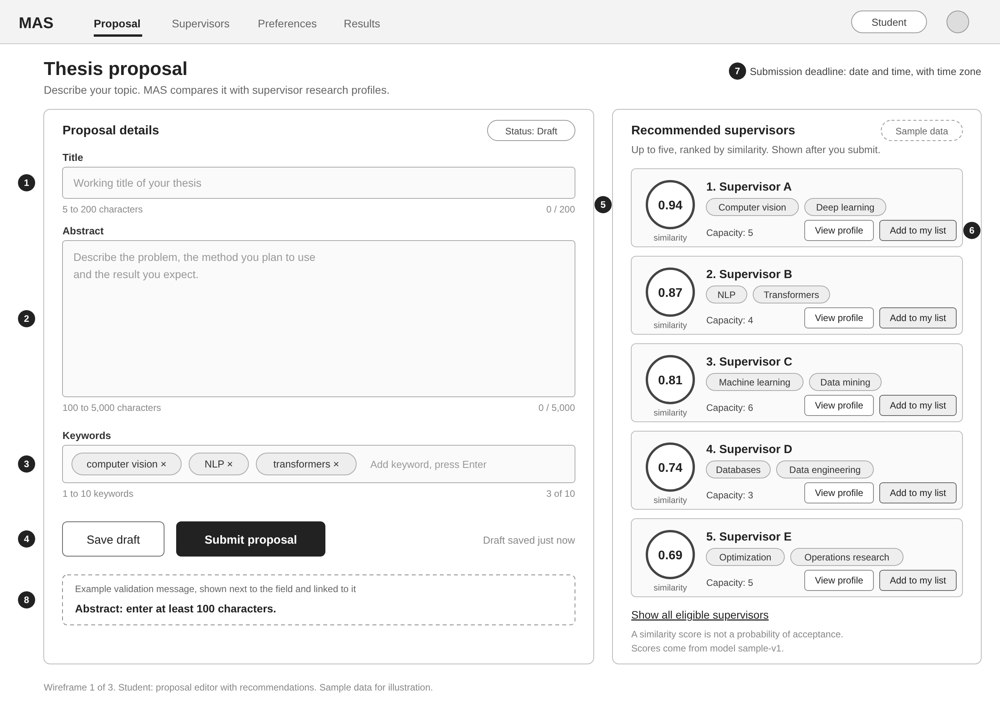

# UX wireframes and prototype specifications

Low-fidelity wireframes for the three key screens of MAS: the student proposal editor, the preference builder and the coordinator panel. Each screen has a wireframe and a short specification of its elements, states and the data it needs from the API.

The wireframes follow the requirements in [`docs/06-requirements-spec.md`](../docs/06-requirements-spec.md). Requirement IDs such as FR-05 or AC-F02 refer to that document.

The SVG files are the editable sources. The PNG files are exports at 2x size.

## Status

| # | Screen | Role | Wireframe | Status |
|---|---|---|---|---|
| 1 | Proposal editor with recommendations | Student | [SVG](wireframes/01-student-proposal.svg), [PNG](wireframes/01-student-proposal.png) | Done |
| 2 | Preference builder (ordered list) | Student | | Planned |
| 3 | Allocation control panel | Coordinator | | Planned |

The interactive Figma prototype and the REST API request and response examples are still to be added.

## Screen 1: proposal editor with recommendations

A student writes the thesis proposal on the left. After submitting it, the right side lists up to five supervisors whose research profiles are most similar to the proposal text.

### Elements

| # | Element | Behavior |
|---|---|---|
| 1 | Title | Single-line text field, 5 to 200 characters (FR-02, AC-F02). |
| 2 | Abstract | Multi-line text field, 100 to 5,000 characters, with a live counter. This text is the main input for the similarity score. |
| 3 | Keywords | Tag input for 1 to 10 non-empty keywords. Enter adds a keyword, the cross removes it. |
| 4 | Save draft and Submit proposal | Save draft stores the fields without submitting. Submit proposal checks all fields, then submits the one proposal allowed per cycle. |
| 5 | Similarity score | A number from 0 to 1 in a circular badge, in descending order down the list (FR-05, AC-F05). The panel carries the line "A similarity score is not a probability of acceptance." and names the model version. |
| 6 | Add to my list | Adds the supervisor to the student's ordered preference list of one to five supervisors (FR-06). The list is edited on screen 2. |
| 7 | Deadline | Submission deadline with its time zone, taken from the cycle settings (FR-04). The server clock decides whether the deadline has passed. |
| 8 | Validation message | Plain text next to the field and linked to it. The last valid proposal stays saved (AC-F02, NFR-04). |

Each recommendation card shows the supervisor's name, research areas and approved capacity. Capacity is the figure the coordinator approved for the cycle (FR-03). Allocation runs as one batch after the deadline, so the screen has no live count of free places.

The supervisor names, scores, capacities and the model name in the wireframe are sample data.

### States to design

- **Draft:** as drawn. The form is editable and the right panel shows a hint to submit the proposal.
- **Loading:** the submit button is disabled and the panel shows placeholders.
- **Recommendations:** up to five cards in descending order of score.
- **Fewer than five eligible supervisors:** all eligible supervisors are shown (AC-F05).
- **No eligible supervisors:** an explicit message instead of cards.
- **Service error:** a retryable message. No recommendations are made up and the submitted preferences stay unchanged (AC-F05).
- **Closed:** the deadline has passed or the inputs are frozen. The form is read-only and shows the last accepted proposal with its submission time (AC-F02).

### Accessibility

Every field has a visible label. Errors appear as text linked to the field, focus stays visible, and a keyboard-only user can complete the form and add supervisors to the list (NFR-04, AC-N04).

### Data the screen needs

- The proposal: title, abstract, keywords, status and submission time.
- The cycle: deadline with time zone, and whether inputs are frozen.
- For each recommended supervisor: id, name, research areas, approved capacity, similarity score, rank and the model version.

### Open questions

- The project overview lists a preferred tech stack as a proposal field. FR-02 has only title, abstract and keywords, so the wireframe leaves the tech stack out until the requirements decide.
- FR-05 ties recommendations to a submitted proposal. Whether a student may preview recommendations for a draft needs a decision.
- It is open whether a student can edit and resubmit after seeing the recommendations, and whether the list then refreshes.
- The content of the View profile page is not defined yet.
